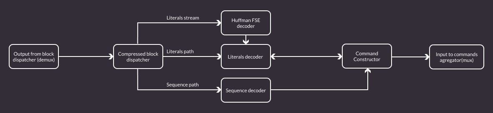
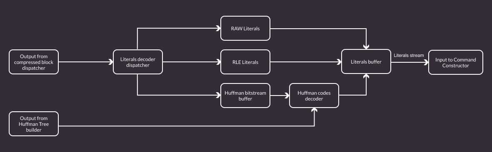
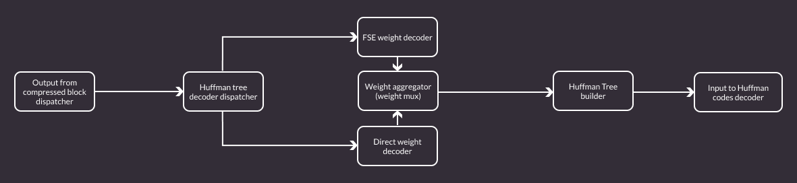
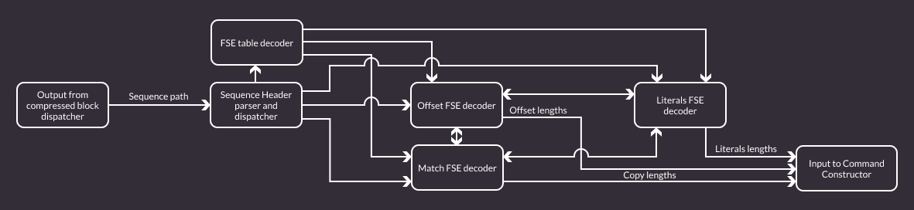

# ZSTD decoder

The ZSTD decoder decompresses the correctly formed ZSTD frames and blocks.
It implements the [RFC 8878](https://www.rfc-editor.org/rfc/rfc8878.html) decompression algorithm.
Overview of the decoder architecture is presented on the diagram below.
The decoder comprises:
* frame decoder,
* block dispatcher,
* 3 types of processing units: RAW, RLE, and compressed,
* command aggregator,
* history buffer,
* repacketizer.

Incoming ZSTD frames are processed in the following order:
1. magic number is detected,
2. frame header is parsed,
3. ZSTD data blocks are being redirected to correct processing unit based on the block header,
4. processing unit results are aggregated in correct order into a stream
and routed to the history buffer,
5. data block outputs are assembled based on the history buffer contents and update history,
6. decoded data is processed by repacketizer in order to prepare the final output of the decoder,
7. (optional) calculated checksum is compared against frame checksum.


## ZSTD decoder architecture

### Top level Proc
This state machine is responsible for receiving encoded ZSTD frames, buffering the input and passing it to decoder's internal components based on the state of the proc.
The states defined for the processing of ZSTD frame are as follows:
* DECODE_MAGIC_NUMBER
* DECODE_FRAME_HEADER
* DECODE_BLOCK_HEADER
* FEED_BLOCK_DECODER
* DECODE_CHECKSUM

After going through initial stages of decoding magic number and frame header, decoder starts the block division process.
It decodes block headers to calculate how many bytes must be sent to the block dispatcher and when the current frame's last data block is being processed.
Knowing that it starts feeding the block decoder with data required for decoding current block.
For this task it uses an 8 byte native interface: a 64-bit data bus and a 64-bit length field that contains the number of correct bits on the data bus.
After transmitting all data required for current block, it loops around to the block header decoding state and when next block header is not found it decodes checksum when it was requested in frame header or finishes ZSTD frame decoding and loops around to magic number decoding.

### ZSTD frame header decoder
This part of the design starts with detecting the ZSTD magic number.
Then it parses and decodes the frame header's content and checks the header's correctness.
If the frame header has the checksum option enabled, this will enable `DECODE_CHECKSUM` stage at the end of the frame decoding where the frame's checksum will be computed and compared with the checksum embedded at the end of the frame stream.

### Block dispatcher (demux)
At this stage, block headers are parsed and removed from the block data stream.
Based on parse values, it directs the block data stream to either RAW, RLE or compressed block sections.
It attaches a unique block ID value to each processed data block.
The IDs are sequential starting from 0 and are reset only after receiving and processing the current frame's last data block.

### RAW
This module passes the received data directly to its output channel.
It preserves the block ID and attaches a tag, stating that the data contains literals and should be placed in the history buffer unchanged, to each data output.

### RLE decoder
This module receives a tuple (s, N), where s is an 8 bit symbol and N is an accompanying `symbol_count`.
The module produces `N*s` repeats of the given symbol.
This step preserves the block ID and attaches the literals tag to all its outputs.

### Compressed block decoder
This part of the design is responsible for decoding the compressed data blocks.
It ingests the bytes stream, internally translates and interprets incoming data.
Only this part of the design creates data chunks tagged both with `literals` and/or `copy`.
This step preserves the block ID.
More in depth description can be found in Compressed block decoder architecture paragraph of this doc.

### Commands aggregator (mux)
This stage takes the output from either RAW, RLE or Command constructor and sends it to the History buffer and command execution stage.
This stage orders streams based on the ID value assigned by the block dispatcher.
It is expected that single base decoders (RAW, RLE, compressed block decoder) will be continuously transmitting a single ID to the point of sending the `last` signal which marks the last packet of currently decoded block.
That ID can change only when mux receives the `last` signal or `last` and `last_block` signals.

It works as a priority mux that waits for a stream with the expected ID.
It continues to read that stream until the `last` signal is set, then it switches to the next stream ID.

The command aggregator starts by waiting for `ID = 0`, after receiving the `last` signal it expects `ID = 1` and so on.
Only when both `last` and `last_block` are set the command aggregator will wait for `ID = 0`.

### History buffer and command execution
This stage receives data which is tagged either `literals` or `copy`.
This stage will show the following behavior, depending on the tag:
* `literals`
    * Packet contents placed as newest in the history buffer,
    * Packet contents copied to the decoder's output,
* `copy`
    * Wait for all previous writes to be completed,
    * Copy `copy_length` literals starting `offset _length` from the newest in history buffer to the decoder's output,
    * Copy `copy_length` literals starting `offset _length` from the newest in history buffer to the history buffer as the newest.

### Compressed block decoder architecture
This part of the design is responsible for processing the compressed blocks up to the `literals`/`copy` command sequence.
This sequence is then processed by the history buffer to generate expected data output.
Overview of the architecture is provided on the diagram below.
The architecture is split into 2 paths: literals path and sequence path.
Architecture is split into 3 paths: literals path, FSE encoded Huffman trees and sequence path.
Literals path uses Hufman trees to decode some types of compressed blocks: Compressed and Treeless blocks.



#### Compressed block dispatcher
This module parses literals section headers to calculate block compression format, Huffmman tree size (if applicable based on compression format), compressed and regenerated sizes for literals.
If compressed block format is `Compressed_Literals_Block`, dispatcher reads Huffman tree header byte from Huffman bitstream, and directs expected number of bytes to the Huffman tree decoder.
Following this step, the module sends an appropriate number of bytes to the literals decoder dispatcher.

After sending literals to literals decompression, it redirects the remaining bytes to the sequence parsing stages.

#### Command Constructor
This stage takes literals length, offset length and copy length.
When `literals length` is greater than 0, it will send a request to the literals buffer to obtain `literals length` literals and then send them to the history buffer.
Then based on the offset and copy length it either creates a match command using the provided offset and match lengths, or uses repeated offset and updates the repeated offset memory.
Formed commands are sent to the Commands aggregator (mux).

### Literals path architecture



#### Literals decoder dispatcher
This module parses and consumes the literals section header.
Based on the received values it passes the remaining bytes to RAW/RLE/Huffman tree/Huffman code decoders.
It also controls the 4 stream operation mode [4-stream mode in RFC](https://www.rfc-editor.org/rfc/rfc8878.html#name-jump_table).

All packets sent to the Huffman bitstream buffer will be tagged either `in_progress` or `finished`.
If the compressed literals use the 4 streams encoding, the dispatcher will send the `finished` tag 4 times, each time a fully compressed stream is sent to the bitstream buffer.

#### RAW Literals
This stage simply passes the incoming bytes as literals to the literals buffer.

#### RLE Literals
This stage works similarly to the `RLE stage` for RLE data blocks.

#### Huffman bitstream buffer
This stage takes data from the literals decoder dispatcher and stores it in the buffer memory.
Once the data with the `finished` tag set is received, this stage sends a tuple containing (start, end) positions for the current bitstream to the Huffman codes decoder.
This stage receives a response from the Huffman codes decoder when decoding is done and all bits got processed.
Upon receiving this message, the buffer will reclaim free space.

#### Huffman codes decoder
This stage receives bitstream pointers from the Huffman bitstream buffer and Huffman tree configuration from the Huffman tree builder.
It accesses the bitstream buffers memory to retrieve bitstream data in reversed byte order and runs it through an array of comparators to decode Huffman code to correct literals values.

#### Literals buffer
This stage receives data either from RAW, RLE or Huffman decoder and stores it.
Upon receiving the literals copy command from the Command Constructor for `N` number of bytes, it provides a reply with `N` literals.

### FSE Huffman decoder architecture



#### Huffman tree decoder dispatcher
This stage parses and consumes the Huffman tree description header.
Based on the value of the Huffman descriptor header, it passes the tree description to the FSE decoder or to direct weight extraction.

#### FSE weight decoder
This stage performs multiple functions.
1. It decodes and builds the FSE distribution table.
2. It stores all remaining bitstream data.
3. After receiving the last byte, it translates the bitstream to Huffman weights using 2 interleaved FSE streams.

#### Direct weight decoder
This stage takes the incoming bytes and translates them to the stream of Huffman tree weights.
The first byte of the transfer defines the number of symbols to be decoded.

#### Weight aggregator
This stage receives tree weights either from the FSE decoder or the direct decoder and transfers them to Huffman tree builder.
This stage also resolves the number of bits of the final weight and the max number of bits required in the tree representation.
This stage will emit the weights and number of symbols of the same weight before the current symbol for all possible byte values.

#### Huffman tree builder
This stage takes `max_number_of_bits` (maximal length of Huffman code) as the first value, then the number of symbols with lower weight for each possible weight (11 bytes), followed by a tuple (number of preceding symbols with the same weight, symbol's_weight).
It's expected to receive weights for all possible byte values in the correct order.
Based on this information, this stage will configure the Huffman codes decoder.

### Sequence path architecture



#### Sequence Header parser and dispatcher
This stage parses and consumes `Sequences_Section_Header`.
Based on the parsed data, it redirects FSE description to the FSE table decoder and triggers Literals FSE, Offset FSE or Match FSE decoder to reconfigure its values based on the FSE table decoder.
After parsing the FSE tables, this stage buffers bitstream and starts sending bytes, starting from the last one received as per ZSTD format.
Bytes are sent to all decoders at the same time.
This stage monitors and triggers sequence decoding phases starting from initialization, followed by decode and state advance.
FSE decoders send each other the number of bits they read.

#### Literals FSE decoder
This stage reconfigures its FSE table when triggered from `sequence header parse and dispatcher`.
It initializes its state as the first FSE decoder.
In the decode phase, this stage is the last one to decode extra raw bits from the bitstream, and the number of ingested bits is transmitted to all other decoders.
This stage is the first stage to get a new FSE state from the bitstream, and it transmits the number of bits it used.

#### Offset FSE decoder
This stage reconfigures its FSE table when triggered from `sequence header parse and dispatcher`.
It initializes its state as the second FSE decoder.
In the decode phase, this stage is the first one to decode extra raw bits from bitstream, and the number of ingested bits is transmitted to all other decoders.
This stage is the last decoder to update its FSE state after the decode phase, and it transmits the number of used bits to other decoders.

#### Match FSE decoder
This stage reconfigures its FSE table when triggered from `sequence header parse and dispatcher`.
It initializes its state as the last FSE decoder.
In the decode phase, this stage is the second one to decode extra raw bits from the bitstream, and the number of ingested bits is transmitted to all other decoders.
This stage is the second stage to update its state after the decode phase, and the number of used bits is sent to all other decoders.

### Repacketizer
This module is used at the end of the processing flow in the ZSTD decoder.
It gathers the output of `SequenceExecutor` proc and processes it to form final output packets of the ZSTD decoder.
Input packets coming from the `SequenceExecutor` consist of:

* data - bitvector of constant length
* length - field describing how many bits in bitvector are valid
* last - flag which marks the last packet in currently decoded ZSTD frame.

It is not guaranteed that all bits in data bitvectors in packets received from `SequenceExecutor` are valid as those can include padding bits which were added in previous decoding steps and now have to be removed.
Repacketizer buffers input packets, removes the padding bits and forms new packets with all bits of the bitvector valid, meaning that all bits are decoded data.
Newly formed packets are then sent out to the output of the whole ZSTD decoder.

## Testing against [libzstd](https://github.com/facebook/zstd)

Design is verified by comparing decoding results to the reference library `libzstd`.
ZSTD frames used for testing are generated with [decodecorpus](https://github.com/facebook/zstd/blob/dev/tests/decodecorpus.c) utility.
Generated frame is then decoded with `libzstd`.
If the results of decoding are valid it is possible to run the same encoded frame through the simulation of DSLX design.
The output of the simulation is gathered and compared with the results of `libzstd` in terms of its size and contents.

Encoded ZSTD frame is generated with function `GenerateFrame(int seed, BlockType btype)` from [data_generator](https://github.com/antmicro/xls/blob/52186-zstd-top/xls/modules/zstd/data_generator.cc) library.
This function takes as arguments the seed for the generator and enum which codes the type of blocks that should be generated in given frame.
The available block types are:

* RAW
* RLE
* COMPRESSED
* RANDOM

The function returns a vector of bytes which represents a valid encoded ZSTD frame.
Such generated frame can be passed to `ParseAndCompareWithZstd(std::vector<uint8_t> frame)` which is responsible for decoding the frame, running simulation and comparing the results.

Tests are available in `zstd_dec_test.cc` file and can be launched with the following bazel command:

```
bazel test //xls/modules/zstd:zstd_dec_cc_test
```

## Known Limitations

* **[WIP]** Uses old version of `SequenceExecutor` (up-to-date version is available in [google/xls/pull/1295](https://github.com/google/xls/pull/1295)) due to [reported issues](https://github.com/google/xls/pull/1295#issuecomment-1943857515) with verilog generation
* **[WIP]** Bugs in current flow cause failures in some of the test cases for RAW and RLE block types
* **[WIP]** Compressed block type is not supported
* Checksum is not being verified

